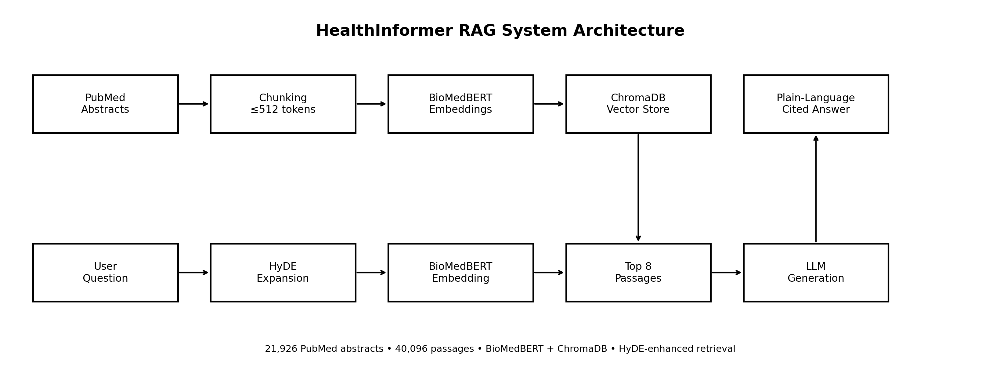
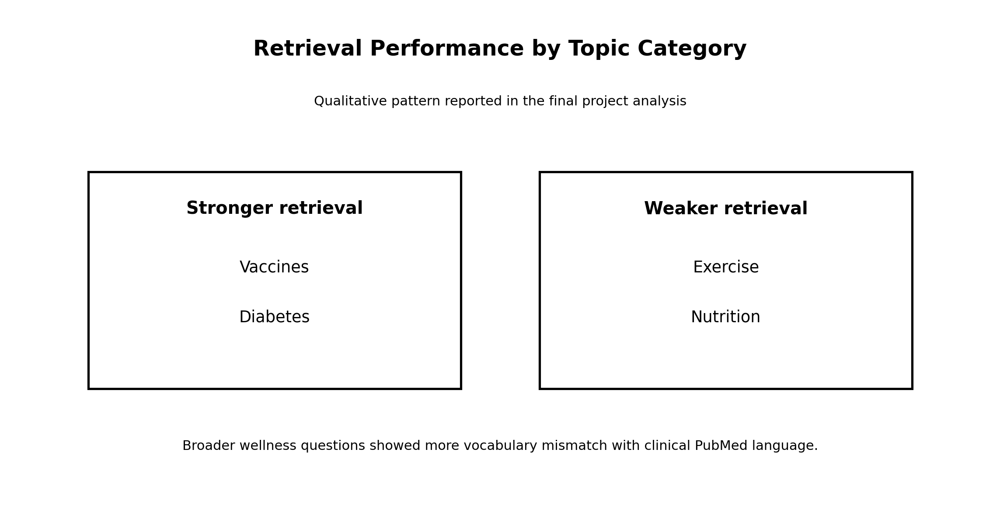
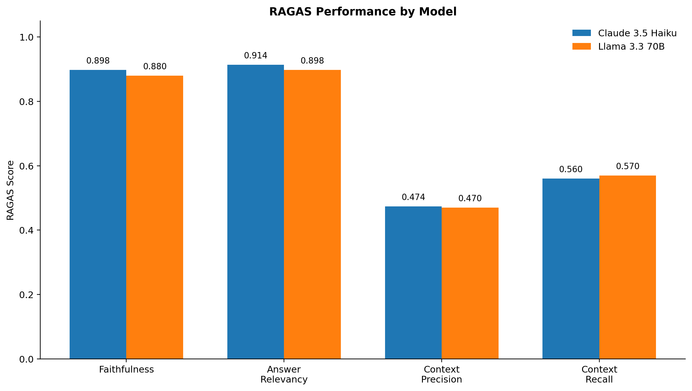
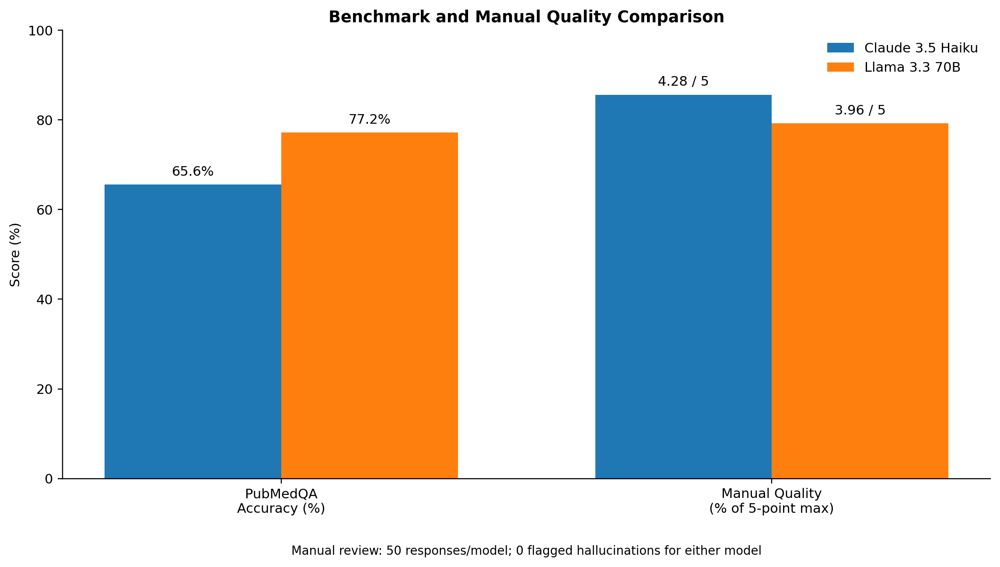

# HealthInformer: RAG-Based Health & Wellness Q&A System

## Overview

HealthInformer is a retrieval-augmented generation (RAG) system designed to answer general health and wellness questions using evidence retrieved from peer-reviewed PubMed literature.

The project combines biomedical information retrieval, vector search, large language models, and systematic evaluation to investigate whether RAG can produce accessible, evidence-grounded answers to health-related questions.

Rather than relying only on an LLM's internal knowledge, HealthInformer retrieves relevant biomedical literature and provides that evidence to the language model as context before generating an answer.

The final system was built using a corpus of **21,926 PubMed abstracts**, which was processed into **40,096 searchable passages** and embedded using a biomedical language model for semantic retrieval.

> **Important:** HealthInformer was developed as an educational research project and is not intended to provide medical diagnosis, treatment recommendations, or personalized medical advice.

---

## Full Project Materials

For the complete methodology, experiments, results, limitations, and discussion:

- **[View Full Project Report](./Project_Report.pdf)**
- **[View Project Poster](./Project_Poster.pdf)**

---

## Research Goal

The project investigated how retrieval-augmented generation could be used to create a health and wellness question-answering system grounded in biomedical literature.

The work focused on several questions:

- How effectively can biomedical literature be retrieved for everyday health questions?
- Can query expansion improve retrieval quality?
- How do different large language models perform when given the same retrieved evidence?
- How faithful and relevant are the generated answers?
- What limitations arise when translating scientific literature into plain-language health information?

---

## System Architecture



The HealthInformer pipeline follows the general RAG workflow:

**User Question → Query Expansion → Semantic Retrieval → Evidence Selection → LLM Generation → Cited Answer**

The system separates retrieval from generation so that responses can be grounded in external biomedical evidence rather than relying exclusively on the language model's internal knowledge.

---

## PubMed Knowledge Base

The retrieval corpus was constructed from PubMed literature covering **36 health and wellness topics**.

The final dataset contained:

- **21,926 PubMed abstracts**
- **40,096 text passages**
- PubMed metadata including article title, authors, journal, PMID, and source link

PubMed literature was collected programmatically using the **NCBI PubMed E-utilities API**.

### Text Chunking

Long abstracts were divided into smaller passages for retrieval.

The chunking strategy used:

- Sentence-boundary splitting
- Maximum target size of approximately **512 tokens**
- One-sentence overlap between neighboring chunks

This helped preserve local context while keeping passages appropriately sized for embedding and retrieval.

---

## Biomedical Embeddings & Vector Search

Each passage was converted into a dense vector representation using **BioMedBERT embeddings**.

The embeddings were stored in **ChromaDB**, which served as the project's vector database.

For each user question, semantic similarity search was used to identify the most relevant passages from the PubMed corpus.

The final RAG configuration retrieved the **top 8 passages** for use as LLM context.

---

## Improving Retrieval with HyDE

One of the major challenges was the vocabulary difference between everyday health questions and biomedical research language.

For example, a user may ask a question using simple wellness terminology while relevant PubMed articles use more technical clinical language.

Several query strategies were explored, including:

- Original user queries
- Keyword-based query rewriting
- Clinical-style query rewriting
- **Hypothetical Document Embeddings (HyDE)**

HyDE generates a hypothetical biomedical-style passage related to the user's question. That passage is embedded and used to search the vector database.

This approach improved relevant-document retrieval from approximately:

**28% → 66%**

and was therefore incorporated into the final retrieval pipeline.

---

## Retrieval Performance

Retrieval quality varied across health topics.



More clinically specific topics such as **vaccines and diabetes** generally retrieved stronger evidence than broader wellness topics such as **exercise and nutrition**.

This highlighted an important limitation of biomedical retrieval systems: broad consumer-health language does not always align closely with the terminology used in scientific literature.

---

## LLM Generation

After retrieval, the original user question and the selected PubMed passages were combined into an augmented prompt.

The language model was instructed to:

- Answer in plain language
- Ground claims in the retrieved evidence
- Cite supporting PubMed sources
- Avoid unsupported medical claims
- Avoid personalized diagnosis or treatment advice

Two language models were evaluated using the same retrieved evidence:

- **Claude 3.5 Haiku**
- **Llama 3.3 70B**

This allowed the project to compare generation quality while keeping the retrieval context consistent.

---

## Evaluation Strategy

HealthInformer was evaluated using several complementary approaches.

### RAGAS Evaluation

A curated evaluation set of **53 health questions** was evaluated using RAGAS metrics:

- Faithfulness
- Answer relevancy
- Context precision
- Context recall



| Metric | Claude 3.5 Haiku | Llama 3.3 70B |
|---|---:|---:|
| Faithfulness | 0.898 | 0.880 |
| Answer Relevancy | 0.914 | 0.898 |
| Context Precision | 0.474 | 0.470 |
| Context Recall | 0.560 | 0.570 |

Both models produced strong faithfulness and answer-relevancy scores, while context precision remained a larger opportunity for improvement.

---

## PubMedQA & Manual Evaluation

The models were also evaluated using the **PubMedQA benchmark** and manual review.

A total of **500 PubMedQA questions** were used for benchmark evaluation.

In addition, **50 generated responses per model** were manually reviewed for response quality and hallucinations.



### Results

**Claude 3.5 Haiku**

- PubMedQA accuracy: **65.6%**
- Manual quality score: **4.28 / 5**
- Hallucinations identified during manual review: **0 / 50**
- Average latency: approximately **13 seconds**

**Llama 3.3 70B**

- PubMedQA accuracy: **77.2%**
- Manual quality score: **3.96 / 5**
- Hallucinations identified during manual review: **0 / 50**
- Average latency: approximately **5.5 seconds**

The results demonstrated that model performance depended on the evaluation dimension being considered rather than producing a single universally superior model.

---

## Analysis Notebooks

The repository includes three cleaned notebooks highlighting the major analytical components of the project.

1. **[System Architecture](./notebooks/NB_01-system_architecture.ipynb)**  
   Documents the end-to-end RAG architecture, PubMed corpus, chunking strategy, embeddings, vector search, HyDE retrieval, and generation pipeline.

2. **[Model Comparisons](./notebooks/NB_02-model_comparisons.ipynb)**  
   Compares Claude 3.5 Haiku and Llama 3.3 70B across RAGAS metrics, PubMedQA performance, manual review, and latency.

3. **[Retrieval Performance](./notebooks/NB_03-retrieval_performance.ipynb)**  
   Examines retrieval performance, HyDE improvements, topic-level retrieval patterns, and remaining retrieval limitations.

---

## Evaluation Code

The `evaluation/` directory contains portfolio versions of the project's evaluation workflow, including:

- RAGAS evaluation
- PubMedQA benchmarking
- Manual spot-check support
- Curated evaluation questions

These components demonstrate how the system was evaluated beyond simply inspecting individual generated responses.

---

## Repository Structure

```text
healthinformer-rag/
│
├── config/
│   ├── __init__.py
│   ├── constants.py
│   └── settings.py
│
├── data/
│
├── evaluation/
│   ├── README.md
│   ├── __init__.py
│   ├── pubmedqa_bench.py
│   ├── ragas_eval.py
│   ├── spot_check.py
│   └── test_questions.py
│
├── figures/
│   ├── pubmedqa_spotcheck_comparison.png
│   ├── ragas_comparison.png
│   ├── retrieval_by_topic.png
│   └── system_architecture.png
│
├── llm/
├── notebooks/
│   ├── NB_01-system_architecture.ipynb
│   ├── NB_02-model_comparisons.ipynb
│   └── NB_03-retrieval_performance.ipynb
│
├── pipeline/
├── prompts/
├── vectorstore/
│
├── .env.example
├── .gitignore
├── DATA_ACCESS.md
├── PORTFOLIO_NOTES.md
├── app.py
├── build_vectorstore.py
├── ingest_data.py
├── run_eval.py
├── run_pipeline.py
├── Project_Report.pdf
├── Project_Poster.pdf
└── README.md
